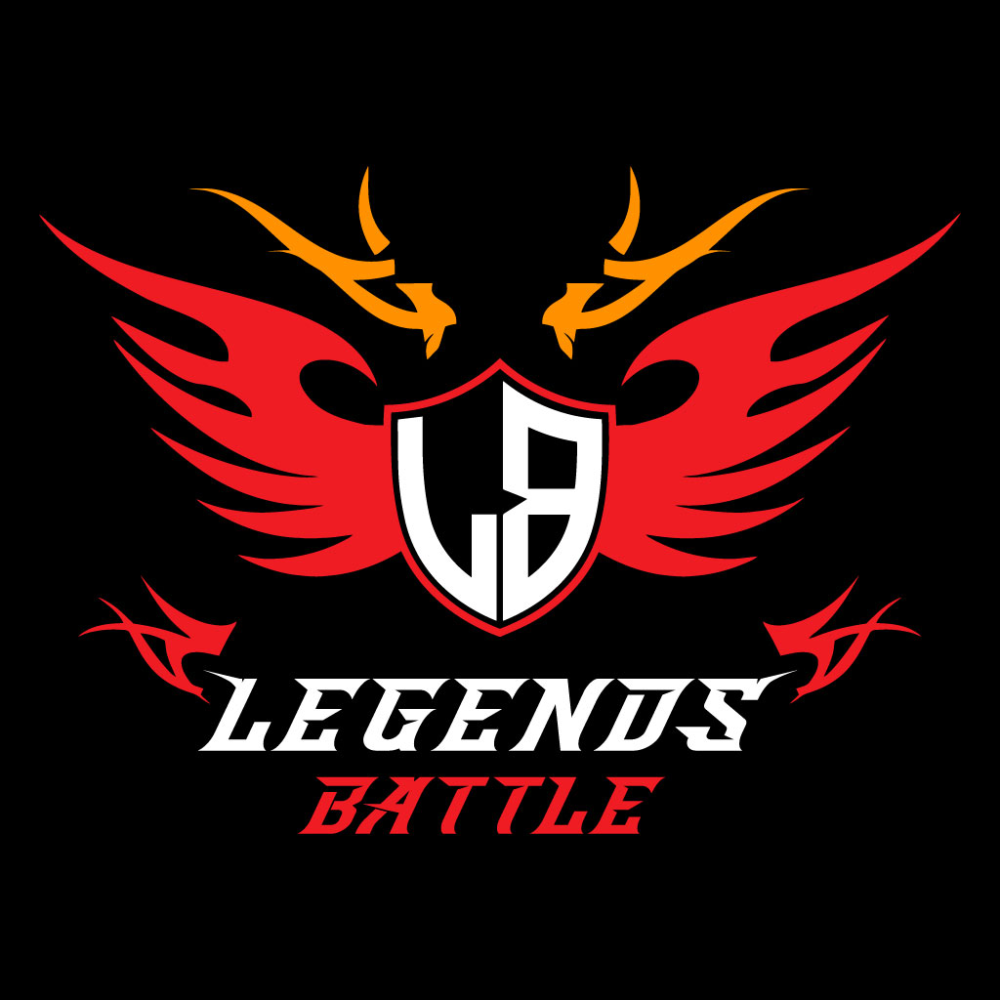

# Introduction

Welcome to the new era of online, decentralized gaming where you own your properties and are not owned by them, governed by the community, and supported by a complex economy where supply and demand are the greatest currency through a fun farming in-game style.

As data gets important in our lifetime, decentralization, accessibility, and ownership of our possessions are becoming possible through blockchain systems. It’s important especially for players, in the gaming space, to be able to control what you hardly won.

Having the possibility to have a decentralized representation of each item you got in your favourite game to be able to trade, speculate, exchange, store or just enjoy the freedom of your unique and rare assets, is not a dream anymore.

On LEGENDSBATTLE, create today your NFT characters linked directly on-chain and build it as you like with your own customized gameplay by your chosen NFT equipped on your character.

Everything is tradeable and exchangeable between players, wallet to wallet: you own every item and in-game property in the form of blockchain NFT.

Based on a PVE system, you can farm with your crypto-friends to upgrade your character and drop NFT Legendsbattle, spells or items in dungeon fights, therefore, giving you the possibility to trade them for better ones in a decentralized way, or even making direct money through any NFT marketplace!

