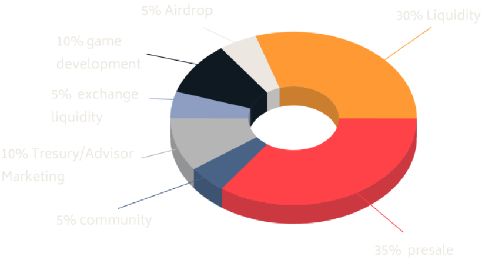

# The LBT Native Token and Tokenomics

Within the Legends Battle network, there is a native token, dubbed LBT, that fuels services within the game and the platform at large. The token helps in different activities, including providing rewards to the investors.

The network has also set unique tokenomics and reward systems focused on the LBT token. First, it charges an 8% tax on every transaction. The network distributes the 8% tax as follows.

**Buyback Fee**

Legends Battles charges a 2% transaction fee to enable users to buy back the LBT token from circulation. The fee will help make the token fully deflationary in the long run.

**Reflection Mechanism**

The network has a reflection mechanism that intends to reward all the holders of the LBT token. 2% of every buy and sell transaction will be reflected in the wallets of all token holders. As the platform gains adoption and transactions increase, so will the rebates.

**Liquidity**

2% of the total transaction will be used for liquidity. The amount will go to DEXes to strengthen the liquidity of the token.

**Marketing**

Accordingly, this platform is setting up a commitment for its long-term growth. 2% of the transaction amount will go to the marketing of this entire project. The marketing amount will help speed up the adoption of this project.

